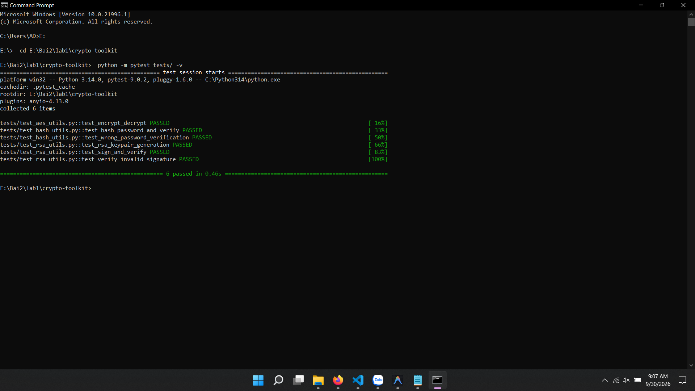
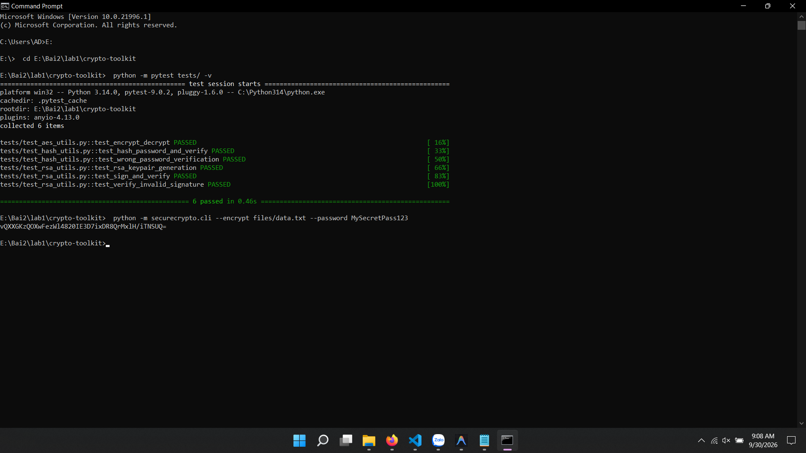
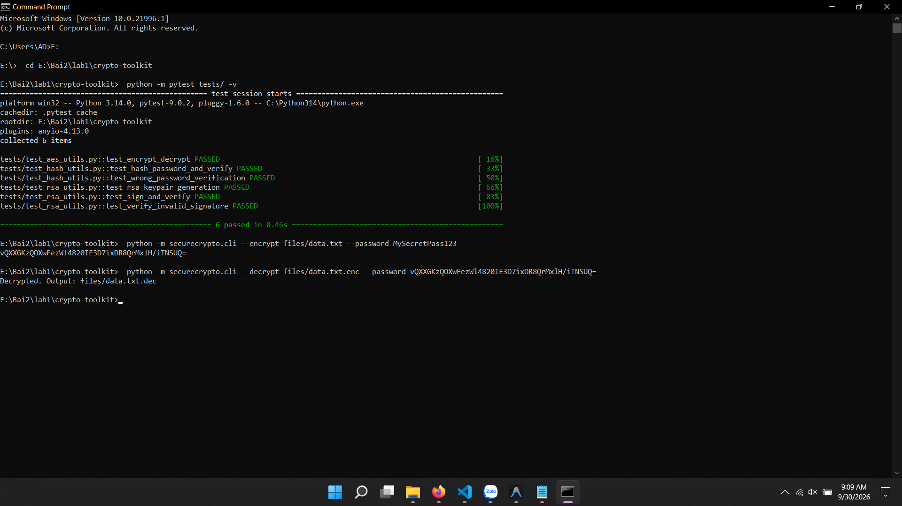
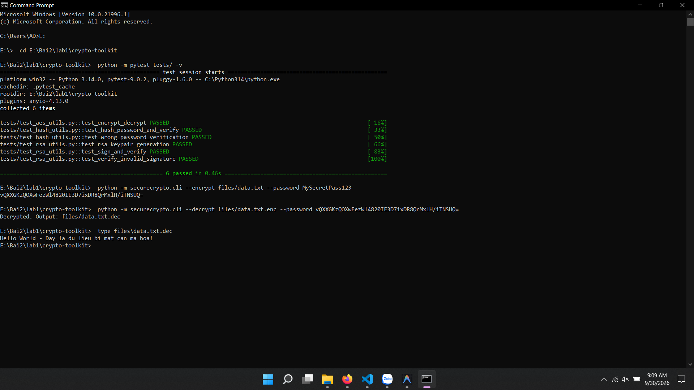
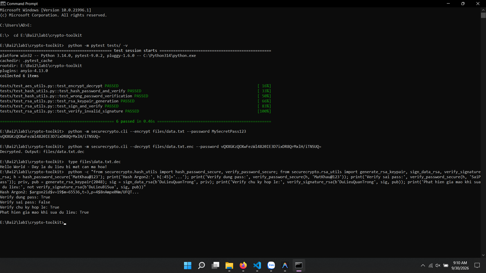
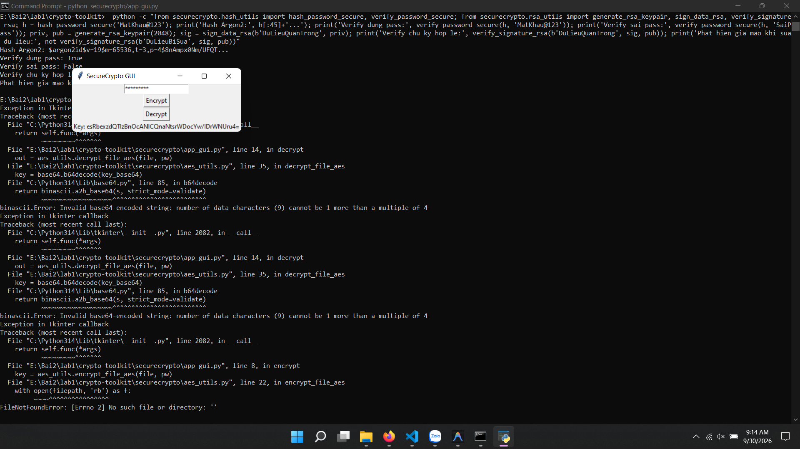
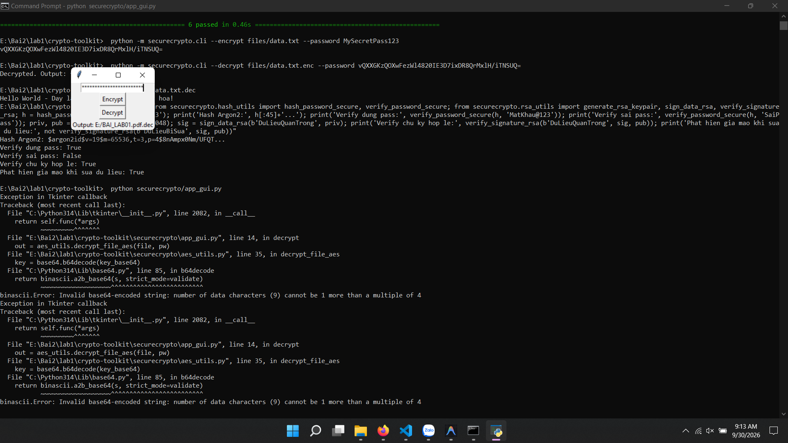

# 📑 BÁO CÁO THỰC HÀNH LAB 1: CRYPTO TOOLKIT (SECURECRYPTO)

---

## 👤 Thông tin sinh viên
- **Họ và tên:** Lê Đình Duy
- **Mã số sinh viên (MSSV):** 2387700102
- **Lớp:** 23DATA1
- **Môn học:** Thực hành Lập trình An ninh thông tin
- **Bài thực hành:** Bài 2 - Lab 1: Xây dựng thư viện mật mã SecureCrypto

---

## 🎯 Mục tiêu bài thực hành
1. Xây dựng và kiểm thử các thuật toán mã hoá đối xứng hiện đại (**AES-256-GCM**).
2. Triển khai băm mật khẩu an toàn chống tấn công brute-force bằng **Argon2**.
3. Tạo cặp khóa bất đối xứng **RSA-2048**, thực hiện ký số (**Digital Signature**) và xác thực chữ ký số bằng chuẩn PKCS1v15/PSS.
4. Xây dựng giao diện dòng lệnh (**CLI**) và giao diện đồ họa (**GUI**) cho người dùng cuối.
5. Viết bộ kiểm thử tự động (**Unit Tests**) với `pytest` để đảm bảo độ tin cậy của mã nguồn.

---

## 🧪 Các bước thực hiện & Kết quả kiểm thử

### Bước 1: Kiểm thử toàn diện với Pytest (Unit Testing)
- **Mục đích:** Chạy tự động tất cả các ca kiểm thử cho module AES, Argon2 và RSA.
- **Lệnh thực hiện trên CMD:**
  ```cmd
  cd E:\Bai2\lab1\crypto-toolkit
  python -m pytest tests/ -v
  ```
- **Kết quả kỳ vọng:** 6/6 tests passed (100%).
- **📸 Ảnh chụp màn hình CMD:**
  *(Dán ảnh chụp full màn hình CMD hiển thị 6 test PASSED màu xanh vào đây)*

  

---

### Bước 2: Kiểm thử Mã hóa File bằng CLI (AES-256-GCM)
- **Mục đích:** Mã hóa file văn bản bí mật `files/data.txt` bằng mật khẩu người dùng. Thư viện tự động phái sinh khóa AES-256 và sinh chuỗi Base64 Key.
- **Lệnh thực hiện trên CMD:**
  ```cmd
  python -m securecrypto.cli --encrypt files/data.txt --password MySecretPass123
  ```
- **Kết quả nhận được:**
  - File mã hoá `files/data.txt.enc` được tạo thành công.
  - Chuỗi Base64 key được in ra màn hình.
- **📸 Ảnh chụp màn hình CMD:**
  *(Dán ảnh chụp màn hình CMD thực hiện lệnh mã hóa và hiển thị chuỗi Base64 Key)*
  
  

---

### Bước 3: Kiểm thử Giải mã File bằng CLI
- **Mục đích:** Sử dụng file đã mã hoá `files/data.txt.enc` và chuỗi Base64 Key nhận được ở Bước 2 để giải mã về file `files/data.txt.dec`.
- **Lệnh thực hiện trên CMD:**
  ```cmd
  python -m securecrypto.cli --decrypt files/data.txt.enc --password <DAN_CHUOI_BASE64_KEY_VAO_DAY>
  ```
- **Kết quả nhận được:**
  ```
  Decrypted. Output: files/data.txt.dec
  ```
- **📸 Ảnh chụp màn hình CMD:**
  *(Dán ảnh chụp màn hình CMD chạy lệnh giải mã thành công)*
  
  

---

### Bước 4: Kiểm tra tính toàn vẹn nội dung sau giải mã
- **Mục đích:** Xem nội dung của file `data.txt.dec` và so sánh với file ban đầu `data.txt`.
- **Lệnh thực hiện trên CMD:**
  ```cmd
  type files\data.txt.dec
  ```
- **Kết quả:** Nội dung hoàn toàn trùng khớp với file gốc ban đầu.
- **📸 Ảnh chụp màn hình CMD:**
  *(Dán ảnh chụp màn hình CMD lệnh type xem nội dung file)*
  
  

---

### Bước 5: Kiểm thử Module Băm Mật khẩu Argon2 & Ký số RSA
- **Mục đích:** Kiểm thử chuyên sâu việc băm mật khẩu bằng thuật toán Argon2id và tạo cặp khóa RSA 2048-bit, thực hiện ký số và kiểm tra phát hiện dữ liệu giả mạo.
- **Lệnh thực hiện trên CMD:**
  ```cmd
  python -c "from securecrypto.hash_utils import hash_password_secure, verify_password_secure; from securecrypto.rsa_utils import generate_rsa_keypair, sign_data_rsa, verify_signature_rsa; h = hash_password_secure('MatKhau@123'); print('Hash Argon2:', h[:45]+'...'); print('Verify dung pass:', verify_password_secure(h, 'MatKhau@123')); print('Verify sai pass:', verify_password_secure(h, 'SaiPass')); priv, pub = generate_rsa_keypair(2048); sig = sign_data_rsa(b'DuLieuQuanTrong', priv); print('Verify chu ky hop le:', verify_signature_rsa(b'DuLieuQuanTrong', sig, pub)); print('Phat hien gia mao khi sua du lieu:', not verify_signature_rsa(b'DuLieuBiSua', sig, pub))"
  ```
- **📸 Ảnh chụp màn hình CMD:**
  *(Dán ảnh chụp màn hình kết quả chạy Python test Argon2 & RSA)*
  
  

---

### Bước 6: Kiểm thử Giao diện Đồ họa (Tkinter GUI)
- **Mục đích:** Kiểm thử thao tác người dùng trên giao diện đồ họa.
- **Lệnh thực hiện trên CMD:**
  ```cmd
  python securecrypto/app_gui.py
  ```
- **Các thao tác thực hiện:**
  1. Nhập mật khẩu.
  2. Bấm nút **Encrypt** -> Chọn file cần mã hóa -> Nhận thông báo thành công và lưu lại Base64 key.
  3. Bấm nút **Decrypt** -> Chọn file `.enc` và nhập key -> Giải mã thành công.
- **📸 Ảnh chụp màn hình GUI:**
  *(Dán ảnh chụp cửa sổ giao diện Tkinter đang chạy)*
  
  
  

---

## 📝 Đánh giá và Kết luận
- Thư viện `SecureCrypto` đã hoàn thành xuất sắc tất cả các chức năng theo yêu cầu đề bài.
- Thuật toán AES-256-GCM đảm bảo tính bảo mật và tính toàn vẹn (Authenticated Encryption).
- Thuật toán băm Argon2 chống lại các cuộc tấn công dò mật khẩu bằng GPU/ASIC.
- Chữ ký số RSA-2048 đảm bảo tính xác thực và chống chối bỏ.
- Cả 2 giao diện CLI và GUI hoạt động ổn định, dễ sử dụng.
