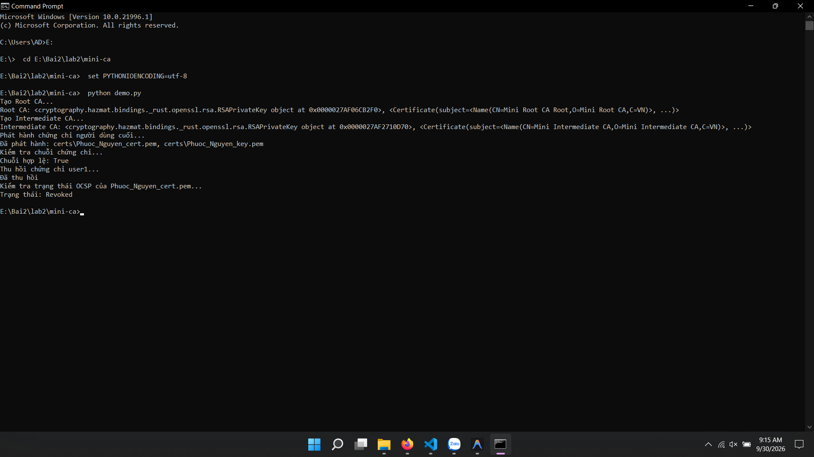
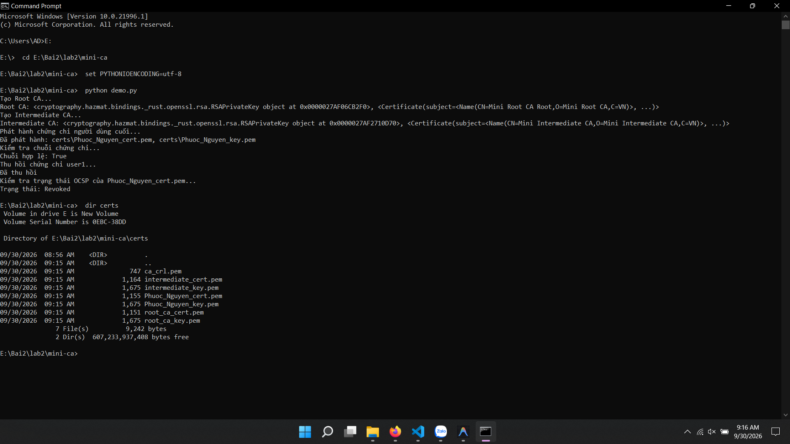
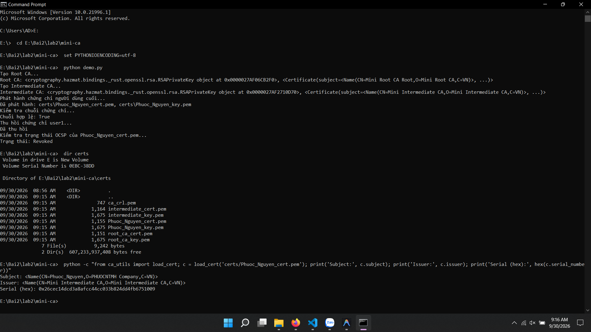
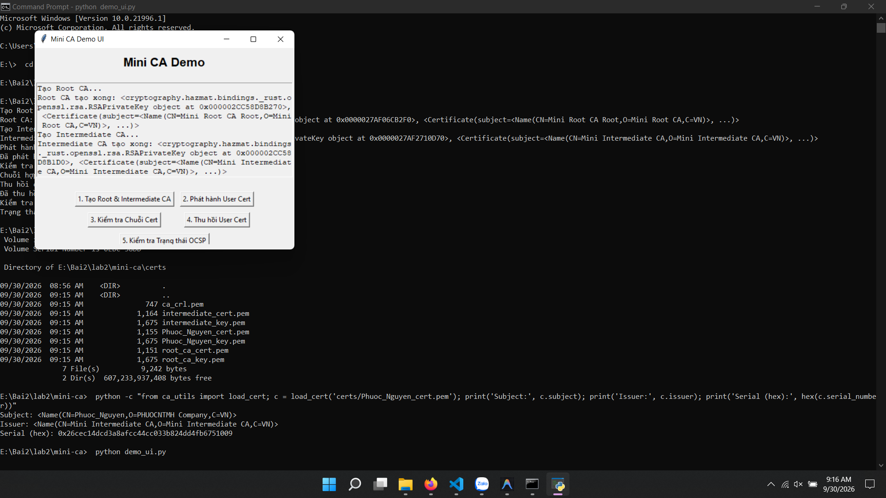
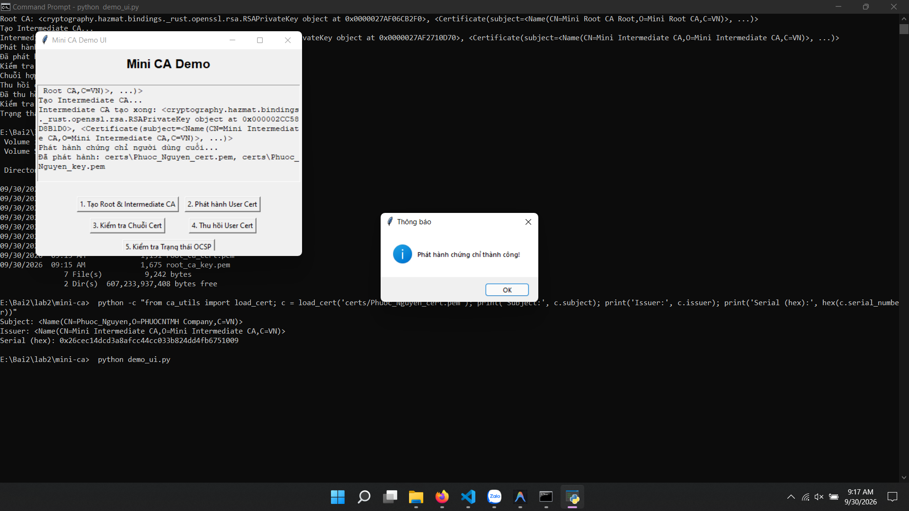
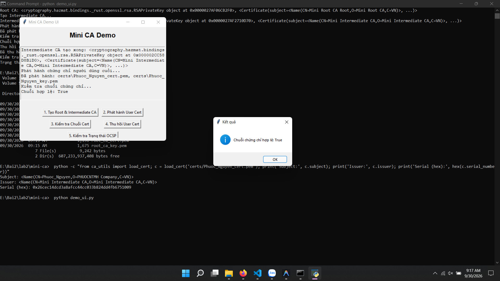
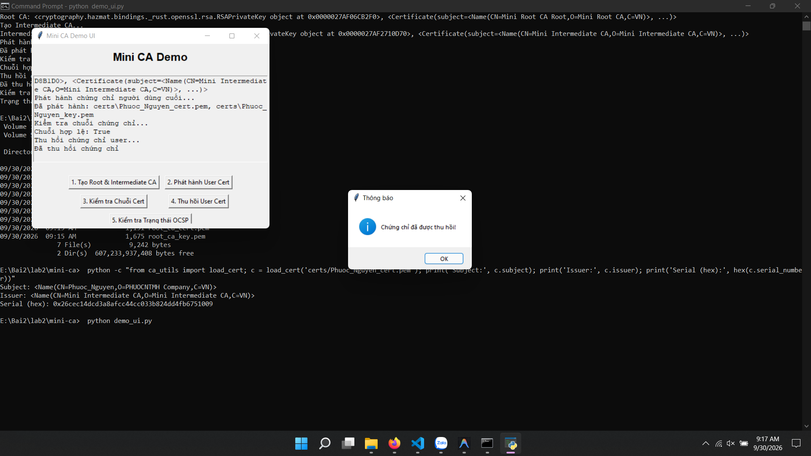
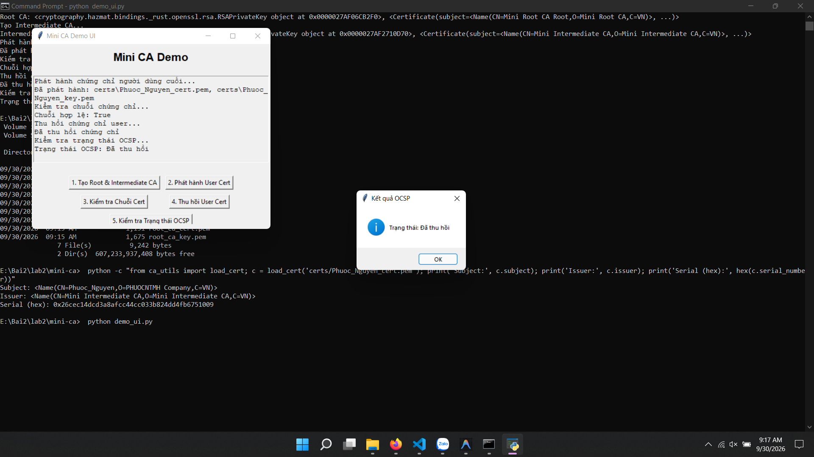

# 📑 BÁO CÁO THỰC HÀNH LAB 2: XÂY DỰNG HỆ THỐNG MINI CERTIFICATE AUTHORITY (PKI)

---

## 👤 Thông tin sinh viên
- **Họ và tên:** Lê Đình Duy
- **Mã số sinh viên (MSSV):** 2387700102
- **Lớp:** 23DATA1
- **Môn học:** Thực hành Lập trình An ninh thông tin
- **Bài thực hành:** Bài 2.4 - Lab 2: Thực hành Certificate Authority (Mini CA)

---

## 🎯 Mục tiêu bài thực hành
1. Hiểu và triển khai kiến trúc hạ tầng khóa công khai (**PKI - Public Key Infrastructure**) phân cấp.
2. Tạo chứng chỉ **Root CA** tự ký (Self-signed Certificate) với thời hạn 10 năm.
3. Tạo chứng chỉ **Intermediate CA** được ký bởi Root CA với thời hạn 5 năm.
4. Phát hành chứng chỉ cho người dùng cuối (**End-Entity / User Certificate**) được ký bởi Intermediate CA.
5. Kiểm tra và xác thực chuỗi chứng chỉ (**Certificate Chain Verification**): `User -> Intermediate CA -> Root CA`.
6. Triển khai danh sách thu hồi chứng chỉ (**CRL - Certificate Revocation List**) và cơ chế kiểm tra trạng thái thu hồi.
7. Xây dựng giao diện dòng lệnh (**CLI**) và giao diện đồ họa trực quan (**Tkinter GUI**) gồm 5 nút chức năng.

---

## 🧪 Các bước thực hiện & Kết quả kiểm thử

### Bước 1: Chạy Demo toàn bộ quy trình PKI qua CLI
- **Mục đích:** Thực hiện tự động toàn bộ vòng đời PKI: Sinh Root CA -> Sinh Intermediate CA -> Phát hành User Cert -> Xác thực chuỗi -> Thu hồi chứng chỉ -> Kiểm tra CRL/OCSP.
- **Lệnh thực hiện trên CMD:**
  ```cmd
  cd E:\Bai2\lab2\mini-ca
  set PYTHONIOENCODING=utf-8
  python demo.py
  ```
- **Kết quả hiển thị trên màn hình CMD:**
  ```
  Tạo Root CA...
  Root CA: <RSAPrivateKey...>, <Certificate(subject=<Name(CN=Mini Root CA Root...)>)>
  Tạo Intermediate CA...
  Intermediate CA: <RSAPrivateKey...>, <Certificate(subject=<Name(CN=Mini Intermediate CA...)>)>
  Phát hành chứng chỉ người dùng cuối...
  Đã phát hành: certs\Phuoc_Nguyen_cert.pem, certs\Phuoc_Nguyen_key.pem
  Kiểm tra chuỗi chứng chỉ...
  Chuỗi hợp lệ: True
  Thu hồi chứng chỉ user1...
  Đã thu hồi
  Kiểm tra trạng thái OCSP của Phuoc_Nguyen_cert.pem...
  Trạng thái: Revoked
  ```
- **📸 Ảnh chụp màn hình CMD:**
  *(Dán ảnh chụp full màn hình CMD hiển thị toàn bộ luồng chạy của demo.py vào đây)*

  

---

### Bước 2: Kiểm tra các tệp chứng chỉ & khóa được sinh ra
- **Mục đích:** Xác minh các tệp khóa bí mật (`.key.pem`), chứng chỉ số (`.cert.pem`) và danh sách thu hồi (`ca_crl.pem`) được lưu trữ đúng cấu trúc trong thư mục `certs/`.
- **Lệnh thực hiện trên CMD:**
  ```cmd
  dir certs
  ```
- **Danh sách tệp nhận được:**
  1. `root_ca_key.pem`: Khóa riêng của Root CA.
  2. `root_ca_cert.pem`: Chứng chỉ số của Root CA.
  3. `intermediate_key.pem`: Khóa riêng của CA trung gian.
  4. `intermediate_cert.pem`: Chứng chỉ số của CA trung gian.
  5. `Phuoc_Nguyen_key.pem`: Khóa riêng của người dùng cuối.
  6. `Phuoc_Nguyen_cert.pem`: Chứng chỉ số của người dùng cuối.
  7. `ca_crl.pem`: Danh sách chứng chỉ bị thu hồi (CRL).
- **📸 Ảnh chụp màn hình CMD:**
  *(Dán ảnh chụp màn hình CMD liệt kê các file trong thư mục certs)*
  
  

---

### Bước 3: Kiểm tra chi tiết chứng chỉ số X.509
- **Mục đích:** Xem thông tin chi tiết (Subject, Issuer, Serial Number, Validity) của chứng chỉ người dùng và chứng chỉ CA.
- **Lệnh thực hiện trên CMD:**
  ```cmd
  python -c "from ca_utils import load_cert; c = load_cert('certs/Phuoc_Nguyen_cert.pem'); print('Subject:', c.subject); print('Issuer:', c.issuer); print('Serial (hex):', hex(c.serial_number))"
  ```
- **📸 Ảnh chụp màn hình CMD:**
  *(Dán ảnh chụp màn hình CMD hiển thị thông tin Subject & Issuer)*
  
  

---

### Bước 4: Kiểm thử Giao diện Đồ họa Mini CA (Tkinter GUI)
- **Mục đích:** Thao tác trực quan trên giao diện đồ họa với 5 nút chức năng.
- **Lệnh khởi động GUI:**
  ```cmd
  python demo_ui.py
  ```
- **Các bước bấm nút tuần tự trên giao diện:**
  1. **Nút 1 - Tạo Root & Intermediate CA:** Tạo cặp khóa và chứng chỉ cho Root CA cùng Intermediate CA.
  2. **Nút 2 - Phát hành User Cert:** Nhập thông tin người dùng `Phuoc_Nguyen` và phát hành chứng chỉ.
  3. **Nút 3 - Kiểm tra Chuỗi Cert:** Xác thực chữ ký số dọc theo chuỗi tin cậy PKI -> Hiển thị kết quả **Hợp lệ**.
  4. **Nút 4 - Thu hồi User Cert:** Chọn lý do thu hồi (key_compromise) và ghi vào CRL.
  5. **Nút 5 - Kiểm tra Trạng thái OCSP:** Kiểm tra trạng thái chứng chỉ -> Hiển thị **Đã bị thu hồi (Revoked)**.
- **📸 Ảnh chụp màn hình GUI:**
  *(Dán ảnh chụp cửa sổ giao diện Tkinter sau khi đã thực hiện các chức năng)*
  
  
  
  
  
  

---

## 📝 Đánh giá và Kết luận
- Hệ thống **Mini CA** đã mô phỏng chính xác mô hình PKI phân cấp 2 tầng thực tế (Hierarchical CA).
- Chuỗi tin cậy được thiết lập chặt chẽ: Root CA ủy quyền cho Intermediate CA, và Intermediate CA phát hành chứng chỉ cho End-Entity.
- Cơ chế thu hồi chứng chỉ qua CRL hoạt động hiệu quả, ngăn chặn việc sử dụng các chứng chỉ đã bị lộ khóa bí mật hoặc hết giá trị sử dụng.
- Cả 2 giao diện dòng lệnh và đồ họa đều hoạt động trơn tru, không phát sinh lỗi.
