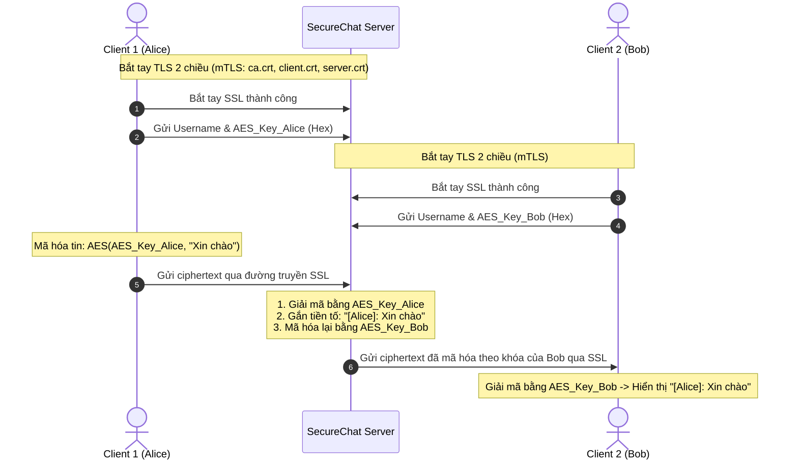

# LAB 1: SECURECHAT - LẬP TRÌNH SOCKET BẢO MẬT VỚI SSL/TLS VÀ AES-256

> **Thông tin sinh viên thực hiện:**
> - **Họ và tên:** Lê Đình Duy
> - **Mã số sinh viên (MSSV):** 2387700102
> - **Lớp:** 23DATA1
> - **Username hệ thống:** dihdyyy


## 1. Giới thiệu tổng quan
**SecureChat** là ứng dụng chat đa luồng an toàn, bảo vệ dữ liệu trao đổi bằng 2 lớp phòng thủ:
1. **Lớp bảo mật giao vận (Transport Layer - SSL/TLS):** Sử dụng xác thực 2 chiều (**Mutual TLS - mTLS**), cả Server và Client đều phải xuất trình chứng chỉ số hợp lệ do Root CA ký.
2. **Lớp bảo mật ứng dụng (Application Layer - E2EE):** Tin nhắn được mã hóa đối xứng **AES-256 (CBC mode)** kèm đệm **PKCS7** và vectơ khởi tạo **IV** ngẫu nhiên 16 bytes.

---

## 2. Cấu trúc thư mục
```text
lab 1/
├── certs/                      # Thư mục lưu trữ bộ chứng chỉ số PKI
│   ├── ca/                     # Root CA (ca.crt, ca.key)
│   ├── server/                 # Server Certificate (server.crt, server.key)
│   └── client/                 # Client Certificate (client.crt, client.key)
├── make-certs.bat              # Script tự động sinh toàn bộ chứng chỉ bằng OpenSSL
├── openssl.cnf                 # Cấu hình phần mở rộng CA (v3_ca) cho OpenSSL
├── message_encryption.py       # Module mã hóa và giải mã AES-256 (CBC)
├── connection_manager.py       # Quản lý danh sách socket client đa luồng (thread-safe)
├── room_manager.py             # Quản lý các phòng chat (general, ...)
├── server.py                   # Socket Server SSL/TLS (lắng nghe cổng 8443)
├── client.py                   # Socket Client kết nối và chat tương tác
└── README.md                   # Hướng dẫn chi tiết bài Lab 1
```

---

## 3. Cơ chế hoạt động & Luồng dữ liệu



---

## 4. Hướng dẫn cài đặt & Chuẩn bị môi trường

### Yêu cầu hệ thống:
- **Python**: Phiên bản 3.10 trở lên.
- **OpenSSL**: Bản Win64 OpenSSL hoặc Git OpenSSL (`C:\Program Files\Git\usr\bin\openssl.exe`).
- **Thư viện Python**:
  ```bash
  pip install cryptography
  ```

### Sinh bộ chứng chỉ số (Nếu chưa có hoặc muốn tạo mới):
Nhấp đúp chuột vào file `make-certs.bat` hoặc mở Terminal chạy:
```powershell
.\make-certs.bat
```
Script sẽ tự động tạo cặp khóa RSA 2048-bit và chứng chỉ cho CA, Server và Client trong thư mục `certs/`.

---

## 5. Hướng dẫn chạy chương trình

### Bước 1: Khởi động Server
Mở Terminal 1:
```powershell
cd "E:\Bai3\lab 1"
python server.py
```
*Kết quả:* Server lắng nghe tại `127.0.0.1:8443` với chế độ xác thực chứng chỉ bắt buộc (`ssl.CERT_REQUIRED`).

### Bước 2: Khởi động Client 1
Mở Terminal 2:
```powershell
cd "E:\Bai3\lab 1"
python client.py
```
- Nhập tên: `Alice`
- Gõ tin nhắn và nhấn `Enter` để gửi.

### Bước 3: Khởi động Client 2
Mở Terminal 3:
```powershell
cd "E:\Bai3\lab 1"
python client.py
```
- Nhập tên: `Bob`
- Quan sát tin nhắn từ `Alice` gửi sang và gõ phản hồi.
- Nhập `exit` khi muốn thoát.

---

## 6. Giải thích chi tiết các module

- **`message_encryption.py`**:
  - `encrypt(plaintext)`: Sinh chuỗi byte IV ngẫu nhiên 16 bytes bằng `os.urandom(16)`. Đệm tin nhắn theo chuẩn PKCS7 (block size 128 bit). Ghép `IV + ciphertext` gửi đi.
  - `decrypt(ciphertext)`: Tách 16 byte đầu làm IV, giải mã phần dữ liệu còn lại bằng khóa AES 256-bit và tiến hành unpad để lấy chuỗi UTF-8 gốc.
- **`connection_manager.py`**: Sử dụng `threading.Lock()` bảo vệ từ điển `self.clients`, lưu trữ socket kết nối, username và encryption key của từng client.
- **`room_manager.py`**: Hỗ trợ mở rộng chat theo nhóm phòng, quản lý các tập hợp socket theo `room_name`.
- **`server.py`**: Sử dụng `ssl.create_default_context(ssl.Purpose.CLIENT_AUTH)` yêu cầu TLS 1.2 trở lên, nạp `ca.crt` để xác thực client. Tạo luồng riêng biệt xử lý từng client kết nối.
- **`client.py`**: Khởi tạo SSLContext với `cafile=ca.crt` và nạp cặp khóa `client.crt` / `client.key`. Tách riêng 1 luồng nhận tin nhắn (`receive_messages`) và luồng chính nhận dữ liệu từ `input()`.

---

## 7. Khắc phục sự cố thường gặp (Troubleshooting)

| Lỗi | Nguyên nhân | Cách khắc phục |
| :--- | :--- | :--- |
| `FileNotFoundError: certs/...` | Chạy lệnh từ thư mục khác | Di chuyển vào thư mục `lab 1` trước khi chạy `python server.py`. Mã nguồn đã tích hợp sẵn `os.path.abspath(__file__)` để tự động xác định đường dẫn. |
| `ssl.SSLCertVerificationError` | Chứng chỉ Client hoặc Server bị lỗi/hết hạn | Chạy lại `make-certs.bat` để tái tạo toàn bộ chứng chỉ đồng bộ với Root CA. |
| `Address already in use (WinError 10048)` | Cổng 8443 đang bị chiếm dụng bởi tiến trình cũ | Tắt tiến trình Python đang chạy ngầm hoặc kiểm tra bằng lệnh: `netstat -ano \| findstr 8443`. |