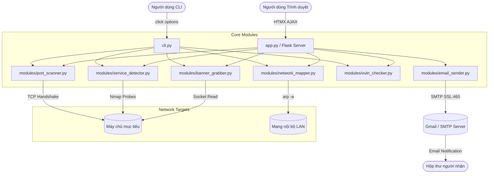

# LAB 2: NETRECON - BỘ CÔNG CỤ TRINH SÁT VÀ THÁM SÁT MẠNG (RECONNAISSANCE TOOLKIT)

> **Thông tin sinh viên thực hiện:**
> - **Họ và tên:** Lê Đình Duy
> - **Mã số sinh viên (MSSV):** 2387700102
> - **Lớp:** 23DATA1
> - **Username:** dihdyyy
> - **Email gửi / nhận báo cáo:** dihdyyy@gmail.com


## 1. Giới thiệu tổng quan
**NetRecon** là bộ công cụ khám phá và trinh sát mạng đa giao diện (**CLI** và **Web Dashboard**) được thiết kế để hỗ trợ kiểm thử an ninh mạng, bao gồm:
- **Quét cổng TCP bất đồng bộ (Port Scanning)** tốc độ cao bằng `asyncio` có kiểm soát tải (`rate limiting`).
- **Nhận dạng phiên bản dịch vụ (Service Detection)** dựa trên sức mạnh của `Nmap`.
- **Lấy chuỗi nhận diện dịch vụ (Banner Grabbing)** trực tiếp qua socket.
- **Khám phá thiết bị mạng cục bộ (Network Mapping)** thông qua phân tích bảng ARP (`arp -a`).
- **Tra cứu lỗ hổng bảo mật đã biết (Vulnerability Checking)** tương ứng với các cổng dịch vụ phổ biến (CVE Matching).
- **Gửi báo cáo qua Email tự động** sử dụng giao thức bảo mật `SMTP_SSL` (cổng 465).

---

## 2. Cấu trúc thư mục
```text
lab2/
├── modules/                    # Thư viện module lõi
│   ├── port_scanner.py         # Quét cổng TCP bất đồng bộ bằng asyncio
│   ├── service_detector.py     # Nhận dạng dịch vụ với Nmap (nmap -sV)
│   ├── banner_grabber.py       # Lấy banner dịch vụ socket timeout ngắn
│   ├── network_mapper.py       # Khám phá sơ đồ mạng qua lệnh arp -a
│   ├── vuln_checker.py         # Tra cứu lỗ hổng CVE theo cổng
│   ├── email_sender.py         # Gửi kết quả qua Gmail SMTP SSL (port 465)
│   ├── filter_utils.py         # Bộ lọc Whitelist và Blacklist địa chỉ IP
│   └── __init__.py             # Đánh dấu package Python
├── templates/                  # Giao diện Web Jinja2 + HTMX
│   ├── layout.html             # Khung HTML gốc, nhúng HTMX CDN và style.css
│   ├── index.html              # Form nhập liệu trinh sát (hx-post="/scan")
│   └── result.html             # Template hiển thị kết quả động
├── static/                     # Tệp tĩnh CSS
│   └── style.css               # Giao diện Dark Mode phong cách hacker/terminal
├── cli.py                      # Giao diện dòng lệnh Click CLI
├── app.py                      # Web Server Flask phục vụ Dashboard
├── requirements.txt            # Danh sách thư viện Python phụ thuộc
├── .env                        # Biến môi trường cấu hình Gmail SMTP (User & App Password)
├── .gitignore                  # Bỏ qua file nhạy cảm và file log
└── README.md                   # Hướng dẫn chi tiết bài Lab 2
```

---

## 3. Kiến trúc hệ thống



---

## 4. Cài đặt & Chuẩn bị môi trường

### Bước 1: Cài đặt thư viện Python
Trong thư mục `lab 2`, mở terminal và chạy:
```powershell
pip install -r requirements.txt
```

### Bước 2: Cài đặt Nmap (Windows)
- Tải bộ cài Nmap: `https://nmap.org/download.html` (chọn bản `nmap-setup.exe`).
- Cài đặt và đảm bảo đường dẫn Nmap đã được thêm vào biến môi trường **PATH**.
- Kiểm tra trong terminal:
  ```powershell
  nmap -v
  ```

### Bước 3: Cấu hình gửi Mail qua file `.env`
Để sử dụng tính năng tự động gửi kết quả quét qua email, chỉnh sửa file `.env`:
```env
SMTP_USER=dia_chi_email_cua_ban@gmail.com
SMTP_PASS=mat_khau_ung_dung_16_ky_tu
```
> *Lưu ý: Để lấy `SMTP_PASS`, truy cập `https://myaccount.google.com/apppasswords`, tạo Mật khẩu ứng dụng với tên `Netrecon`.*

---

## 5. Hướng dẫn sử dụng

### Cách 1: Sử dụng qua Giao diện Dòng lệnh (CLI)
Di chuyển vào thư mục `lab 2`:
```powershell
cd "E:\Bai3\lab 2"
```

1. **Quét cổng mở (Port Scan):**
   ```powershell
   python cli.py --target 127.0.0.1 --ports 135,445,8080 --mode scan
   ```

2. **Khám phá sơ đồ mạng ARP (Network Map):**
   ```powershell
   python cli.py --target 127.0.0.1 --ports 80 --mode map
   ```

3. **Kiểm tra lỗ hổng CVE phổ biến (Vulnerability Check):**
   ```powershell
   python cli.py --target 127.0.0.1 --ports 21,22,80,443 --mode vuln
   ```

4. **Lấy banner dịch vụ (Banner Grab):**
   ```powershell
   python cli.py --target 127.0.0.1 --ports 80,443 --mode banner
   ```

5. **Chạy toàn bộ các tính năng trinh sát (All in one):**
   ```powershell
   python cli.py --target 127.0.0.1 --ports 22,80,443 --mode all
   ```

---

### Cách 2: Sử dụng qua Giao diện Web (Web Dashboard)
1. Khởi chạy Flask Server:
   ```powershell
   cd "E:\Bai3\lab 2"
   python app.py
   ```
2. Mở trình duyệt web và truy cập địa chỉ:
   ```text
   http://localhost:5000/
   ```
3. Nhập các thông số trên giao diện:
   - **Target IP**: Địa chỉ IP mục tiêu (ví dụ: `127.0.0.1` hoặc IP trong mạng LAN).
   - **Ports**: Danh sách các cổng cần quét (ví dụ: `22,80,443,135,445`).
   - **Mode**: Lựa chọn chế độ quét (`All`, `Port Scan`, `Service Detection`, `Banner Grab`, `Network Map`, `Vulnerability Check`).
   - **Email nhận kết quả**: Điền địa chỉ email để nhận báo cáo tự động.
4. Nhấn nút **Scan**:
   - Giao diện HTMX sẽ gửi yêu cầu ngầm và cập nhật kết quả trực tiếp lên vùng kết quả mà không cần tải lại toàn bộ trang web.
   - Nếu cấu hình đúng thông tin `.env`, hệ thống sẽ gửi một email báo cáo chi tiết đến hòm thư đã nhập.

---

## 6. Ghi nhật ký (Logging)
Mọi thao tác trinh sát (thời gian, địa chỉ IP, trạng thái cổng, banner) đều được ghi nhận vào tệp log:
```text
lab2/netrecon.log
```
Mỗi dòng log có định dạng: `INFO:root:[YYYY-MM-DD HH:MM:SS] Nội dung ghi nhận`.

---

## 7. Khắc phục sự cố thường gặp (Troubleshooting)

| Vấn đề | Nguyên nhân | Cách khắc phục |
| :--- | :--- | :--- |
| `nmap: command not found` | Chưa cài đặt Nmap hoặc chưa thêm vào PATH | Tải Nmap từ nmap.org và thêm `C:\Program Files (x86)\Nmap` vào biến môi trường PATH của Windows. |
| `[-] Email failed: ...` | Sai mật khẩu ứng dụng Gmail | Cần sử dụng **Google App Password** (16 ký tự, bật 2FA) thay vì mật khẩu đăng nhập Gmail thông thường. |
| Port scan không thấy cổng mở | Tường lửa Windows chặn hoặc máy mục tiêu tắt cổng | Kiểm tra xem cổng mục tiêu có dịch vụ đang lắng nghe không (`netstat -an`), hoặc thử quét các cổng hệ thống như `135, 445`. |