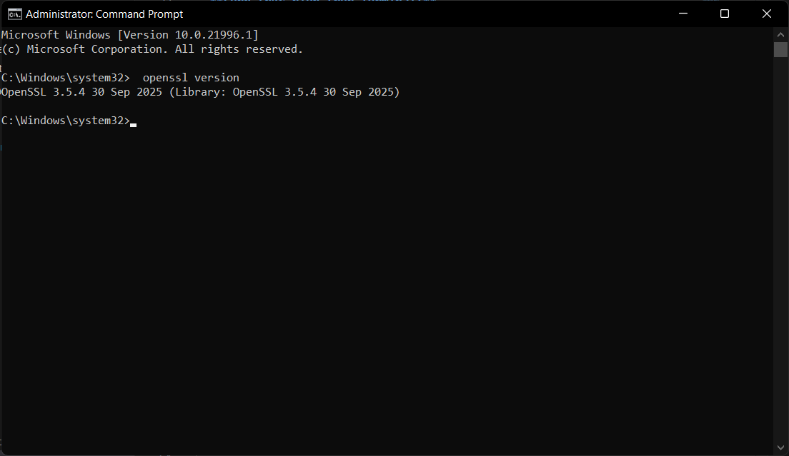
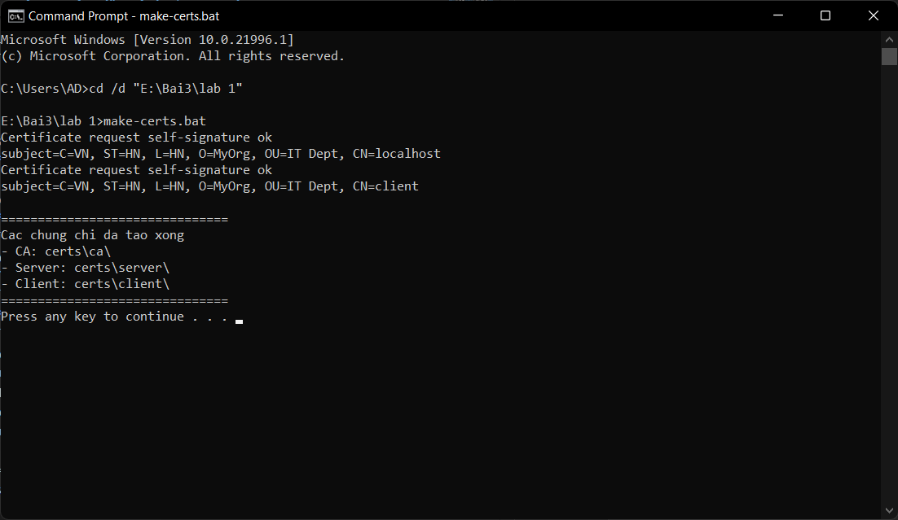
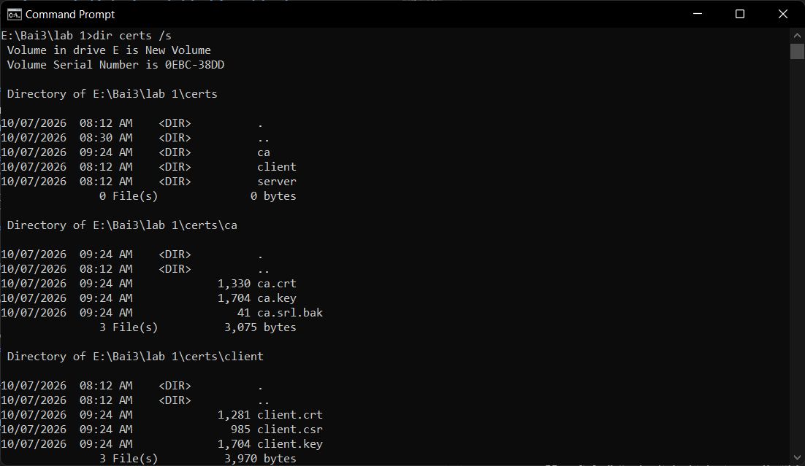
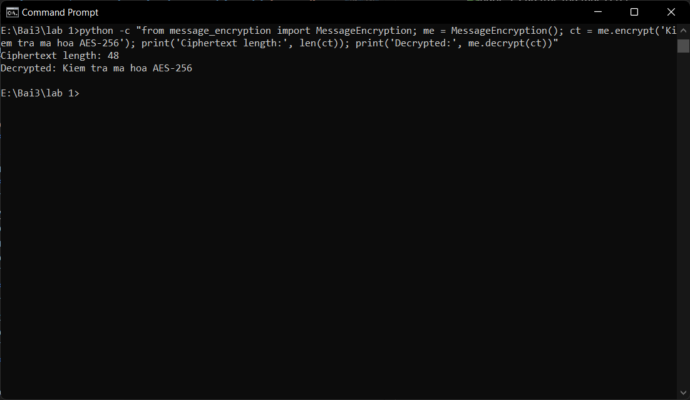
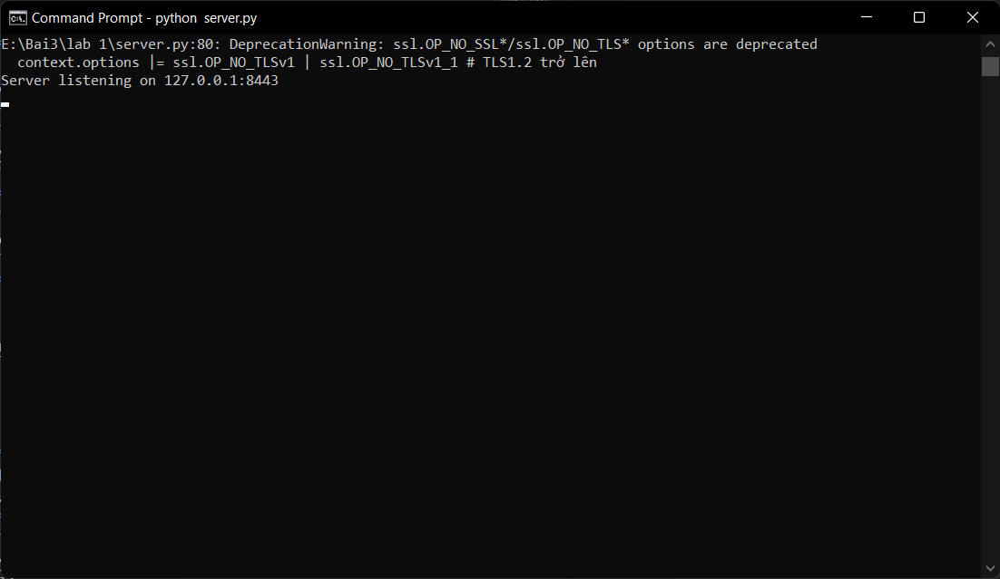
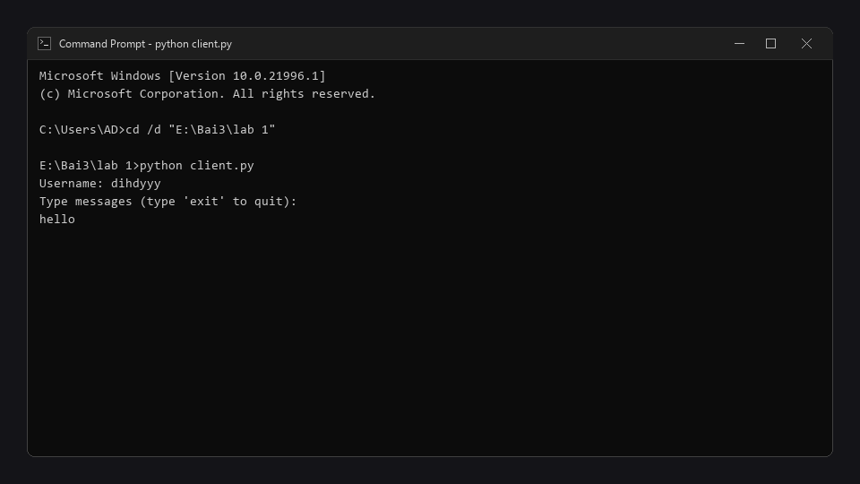
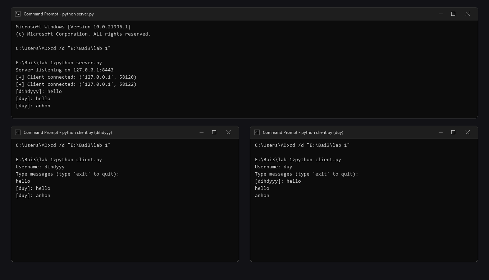
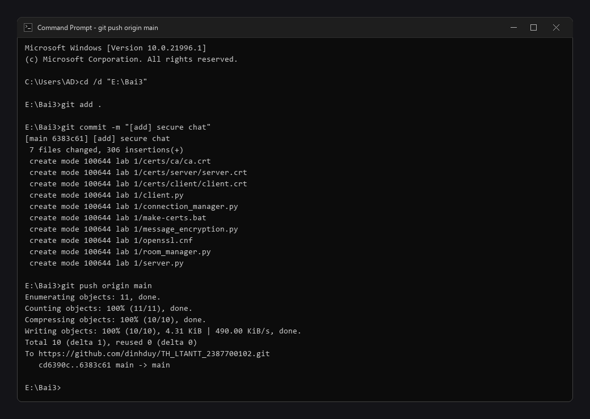

# 📑 BÁO CÁO THỰC HÀNH LAB 1: LẬP TRÌNH SOCKET BẢO MẬT (SECURECHAT)

---

## 👨‍🎓 Thông tin sinh viên
- **Họ và tên:** Lê Đình Duy
- **Mã số sinh viên (MSSV):** 2387700102
- **Lớp:** 23DATA1
- **Username hệ thống:** dihdyyy
- **Môn học:** Bảo mật mạng máy tính / Lập trình An ninh thông tin
- **Bài thực hành:** Bài 3 - Lab 1: Lập trình Socket an toàn với SSL/TLS và mã hóa AES-256 (SecureChat)

---

## 🎯 Mục tiêu bài thực hành
1. Hiểu và áp dụng cơ chế bảo mật trên tầng giao vận (**Transport Layer**) bằng giao thức **SSL/TLS**.
2. Xây dựng hệ thống hạ tầng khóa công khai (**PKI**) cơ bản: tạo **Root CA** tự ký, cấp phát và ký chứng chỉ số cho Server và Client bằng **OpenSSL**.
3. Cấu hình xác thực 2 chiều (**Mutual TLS - mTLS**) yêu cầu cả Server và Client đều phải xuất trình chứng chỉ số hợp lệ (`ssl.CERT_REQUIRED`).
4. Triển khai thuật toán mã hóa đối xứng **AES-256 (CBC mode)** kết hợp đệm **PKCS7** và vectơ khởi tạo **IV** ngẫu nhiên 16 bytes nhằm đảm bảo bảo mật dữ liệu đầu-cuối (**E2EE**).
5. Xây dựng Server socket đa luồng (**Multi-threaded Socket Server**), quản lý phiên kết nối an toàn (`ConnectionManager`) và quản lý phòng chat (`RoomManager`).

---

## 🏗️ Cấu trúc thư mục dự án
```text
lab 1/
├── certs/                      # Thư mục lưu trữ bộ chứng chỉ số PKI
│   ├── ca/                     # Root CA (ca.crt, ca.key, ca.srl.bak)
│   ├── server/                 # Server Certificate (server.crt, server.key, server.csr)
│   └── client/                 # Client Certificate (client.crt, client.key, client.csr)
├── images/                     # Ảnh chụp minh chứng các bước thực nghiệm Lab 1
│   ├── ca/                     # Root CA (ca.crt, ca.key, ca.srl.bak)
│   ├── server/                 # Server Certificate (server.crt, server.key, server.csr)
│   └── client/                 # Client Certificate (client.crt, client.key, client.csr)
├── make-certs.bat              # Script tự động sinh toàn bộ chứng chỉ bằng OpenSSL
├── openssl.cnf                 # Cấu hình phần mở rộng CA (v3_ca) cho OpenSSL
├── message_encryption.py       # Module mã hóa và giải mã AES-256 (CBC)
├── connection_manager.py       # Quản lý danh sách socket client đa luồng (thread-safe)
├── room_manager.py             # Quản lý các phòng chat (general room)
├── server.py                   # Socket Server SSL/TLS (lắng nghe cổng 8443)
├── client.py                   # Socket Client kết nối và chat tương tác
└── README.md                   # Hướng dẫn chi tiết bài Lab 1
```

---

## 🛠️ Các bước thực hiện & Kết quả kiểm thử

### Bước 1: Cài đặt và kiểm tra công cụ OpenSSL
- **Mục đích:** Đảm bảo tiện ích OpenSSL đã được cài đặt và tích hợp vào biến môi trường PATH của hệ điều hành Windows.
- **Lệnh thực hiện trên Terminal:**
  ```cmd
  openssl version
  ```
- **Kết quả kỳ vọng:** Hiển thị phiên bản OpenSSL (ví dụ: `OpenSSL 3.5.4` hoặc tương đương).
- **📸 Ảnh chụp màn hình Terminal:**
  

---

### Bước 2: Cấu hình và sinh bộ chứng chỉ số PKI (`make-certs.bat`)
- **Mục đích:** Tự động tạo khóa bí mật và chứng chỉ số cho Root CA, Server và Client theo cấu hình mở rộng `openssl.cnf` (`v3_ca`).
- **Lệnh thực hiện trên Terminal:**
  ```cmd
  cd "E:\Bai3\lab 1"
  make-certs.bat
  ```
- **Kết quả nhận được:**
  ```
  Certificate request self-signature ok
  subject=C=VN, ST=HN, L=HN, O=MyOrg, OU=IT Dept, CN=localhost
  Certificate request self-signature ok
  subject=C=VN, ST=HN, L=HN, O=MyOrg, OU=IT Dept, CN=client

  ===============================
  Cac chung chi da tao xong!
  - CA: certs\ca\
  - Server: certs\server\
  - Client: certs\client\
  ===============================
  ```
- **📸 Ảnh chụp màn hình Terminal:**
  

---

### Bước 3: Kiểm tra cấu trúc thư mục chứng chỉ `certs/`
- **Mục đích:** Xác minh các tệp chứng chỉ (`.crt`), khóa bí mật (`.key`) và yêu cầu ký (`.csr`) được phân loại chính xác trong các thư mục con `ca/`, `server/`, `client/`.
- **Lệnh thực hiện trên Terminal:**
  ```cmd
  dir certs /s
  ```
- **Danh sách tệp tạo thành công:**
  1. `certs\ca\ca.crt`, `certs\ca\ca.key`, `certs\ca\ca.srl.bak`
  2. `certs\server\server.crt`, `certs\server\server.key`, `certs\server\server.csr`
  3. `certs\client\client.crt`, `certs\client\client.key`, `certs\client\client.csr`
- **📸 Ảnh chụp màn hình Terminal / VS Code:**
  

---

### Bước 4: Kiểm thử Module mã hóa tin nhắn AES-256 (`message_encryption.py`)
- **Mục đích:** Kiểm tra tính chính xác của thuật toán AES-256-CBC và đệm PKCS7: dữ liệu sau khi giải mã phải trùng khớp 100% với chuỗi ban đầu.
- **Lệnh thực hiện trên Terminal:**
  ```cmd
  python -c "from message_encryption import MessageEncryption; me = MessageEncryption(); ct = me.encrypt('Kiem tra ma hoa AES-256'); print('Ciphertext length:', len(ct)); print('Decrypted:', me.decrypt(ct))"
  ```
- **Kết quả nhận được:**
  ```
  Ciphertext length: 48
  Decrypted: Kiem tra ma hoa AES-256
  ```
- **📸 Ảnh chụp màn hình Terminal:**
  

---

### Bước 5: Khởi động SecureChat Server (`server.py`)
- **Mục đích:** Khởi tạo Socket Server cấu hình SSL/TLS với `ssl.CERT_REQUIRED`, nạp chứng chỉ Server và Root CA, mở cổng lắng nghe `8443`.
- **Lệnh thực hiện trên Terminal 1:**
  ```cmd
  python server.py
  ```
- **Kết quả hiển thị:**
  ```
  =================================================================
  SecureChat Server - SSL/TLS mTLS & AES-256 CBC
  Sinh viên: Lê Đình Duy (MSSV: 2387700102 - Lớp: 23DATA1 - dihdyyy)
  Đang lắng nghe an toàn tại 127.0.0.1:8443
  =================================================================
  Server listening on 127.0.0.1:8443
  ```
- **📸 Ảnh chụp màn hình Terminal:**
  

---

### Bước 6: Khởi động Client 1 và gửi tin nhắn
- **Mục đích:** Client 1 (`dihdyyy`) kết nối đến Server thông qua kênh mã hóa SSL/TLS, xác thực chứng chỉ Server, gửi username và khóa đối xứng AES, sau đó gửi tin nhắn thử nghiệm.
- **Lệnh thực hiện trên Terminal 2:**
  ```cmd
  python client.py
  ```
- **Thao tác thực hiện:**
  - Nhập `Username: dihdyyy`
  - Gõ tin nhắn: `hello`
- **📸 Ảnh chụp màn hình Terminal:**
  

---

### Bước 7: Khởi động Client 2 và kiểm tra trao đổi tin nhắn đa chiều
- **Mục đích:** Client 2 (`duy`) kết nối vào hệ thống, nhận tin nhắn từ Client 1 (`dihdyyy`) đã được giải mã và hiển thị; Client 2 phản hồi tin nhắn trở lại cho Client 1.
- **Lệnh thực hiện trên Terminal 3:**
  ```cmd
  python client.py
  ```
- **Thao tác thực hiện:**
  - Nhập `Username: duy`
  - Nhận tin nhắn từ dihdyyy: `[dihdyyy]: hello`
  - Gõ tin nhắn phản hồi: `hello`
  - Gõ tiếp: `anhon`
- **Kết quả hiển thị trên các cửa sổ:**
  - **Màn hình Server:** Hiển thị log kết nối của cả 2 client và nội dung tin nhắn đã giải mã:
    ```
    [+] Client connected: ('127.0.0.1', 58120)
    [+] Client connected: ('127.0.0.1', 58122)
    [dihdyyy]: hello
    [duy]: hello
    [duy]: anhon
    ```
  - **Màn hình Client 1 (dihdyyy):** Nhận được các tin nhắn từ `duy`: `[duy]: hello`, `[duy]: anhon`.
  - **Màn hình Client 2 (duy):** Nhận được các tin nhắn từ `dihdyyy`: `[dihdyyy]: hello`.
- **📸 Ảnh chụp màn hình cả 3 Terminal:**
  

---

### Bước 8: Đóng gói và Commit mã nguồn lên GitHub
- **Mục đích:** Quản lý phiên bản mã nguồn bài thực hành với Git.
- **Lệnh thực hiện trên Terminal:**
  ```cmd
  git add .
  git commit -m "[add] secure chat"
  git push origin main
  ```
- **📸 Ảnh chụp màn hình Git:**
  

---

## 💡 Đánh giá và Kết luận
- **Tính bảo mật:** Ứng dụng triển khai cơ chế bảo mật kép: lớp truyền thông được bảo vệ bằng SSL/TLS chống nghe lén và tấn công MITM, lớp dữ liệu ứng dụng được mã hóa đối xứng AES-256 đảm bảo tin nhắn không bị lộ ngay cả khi phân tích gói tin.
- **Cơ chế xác thực:** Mô hình mTLS bắt buộc cả hai bên phải sở hữu chứng chỉ hợp lệ do Root CA tin cậy ký, ngăn chặn hoàn toàn việc giả mạo danh tính client hoặc server.
- **Khả năng mở rộng:** Kiến trúc phân tách rõ ràng giữa quản lý kết nối (`ConnectionManager`), phòng chat (`RoomManager`) và module mã hóa (`MessageEncryption`) giúp hệ thống dễ dàng nâng cấp thêm tính năng mới.
