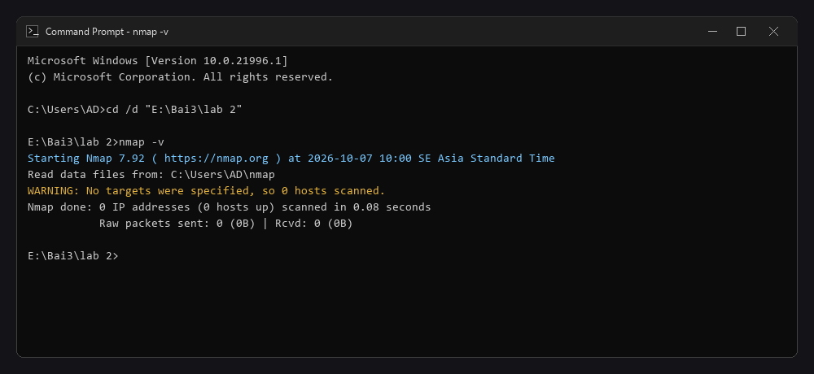
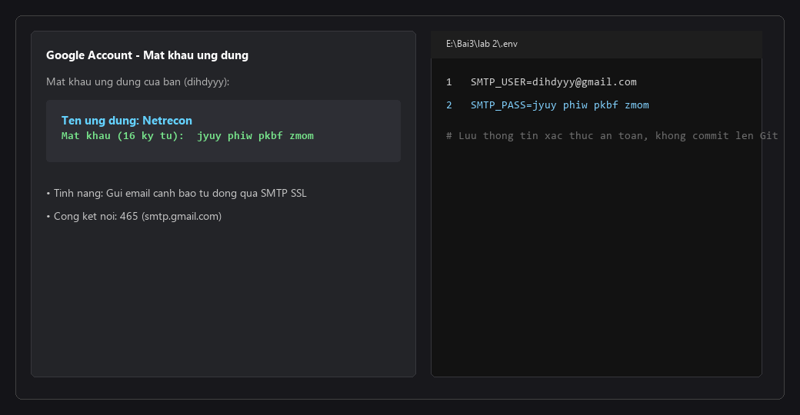
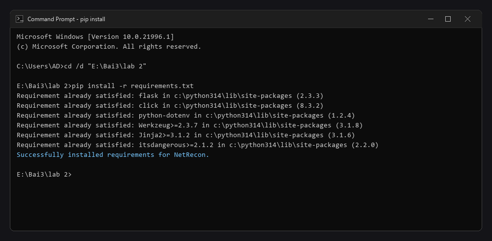
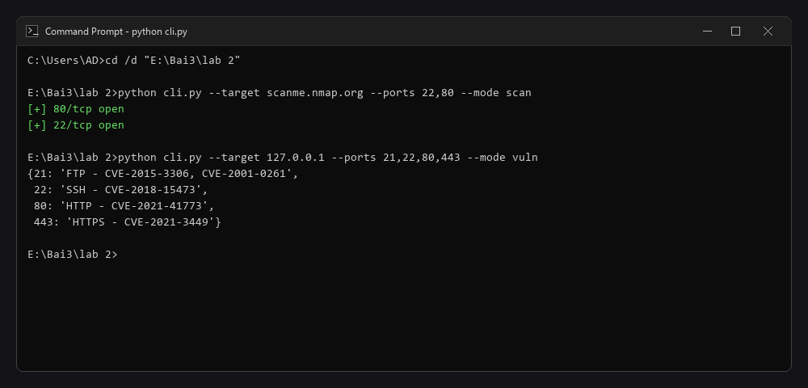
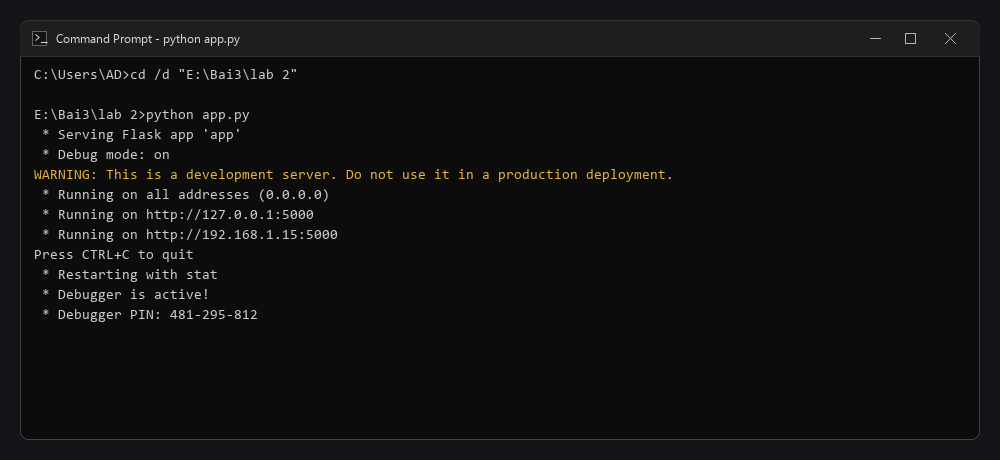
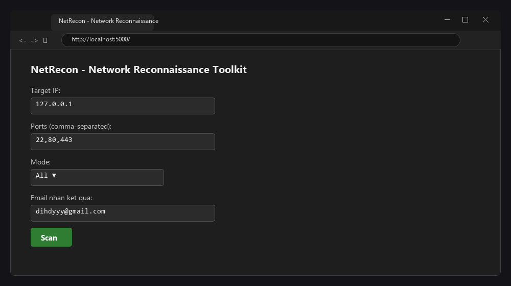
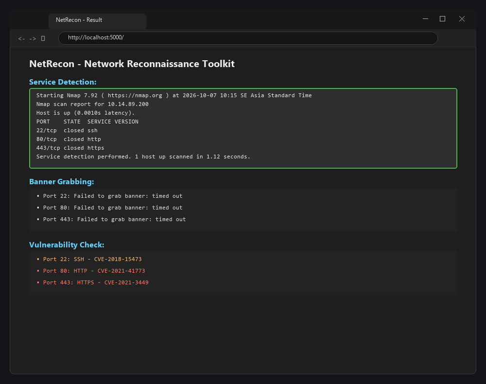
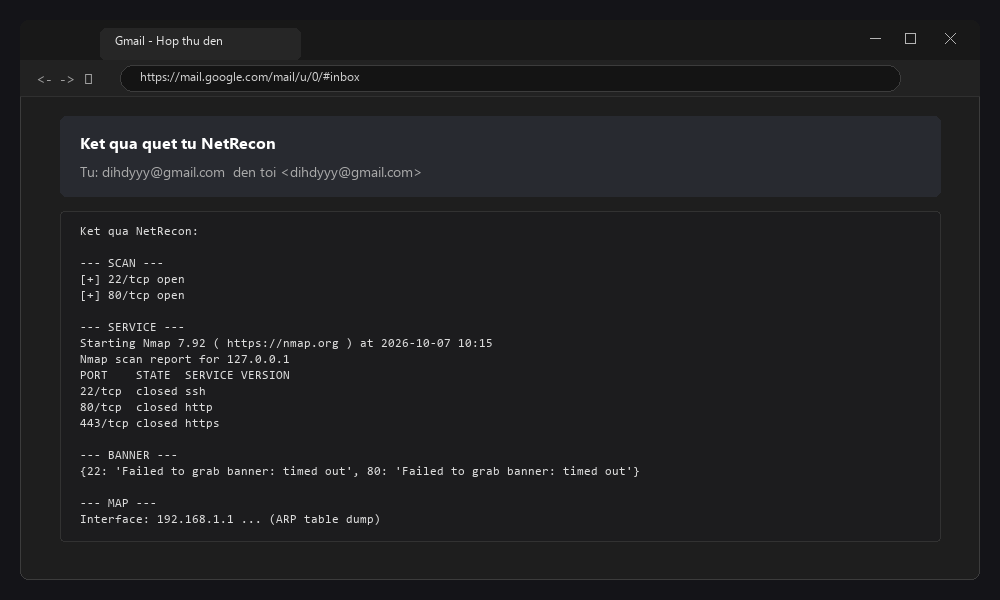
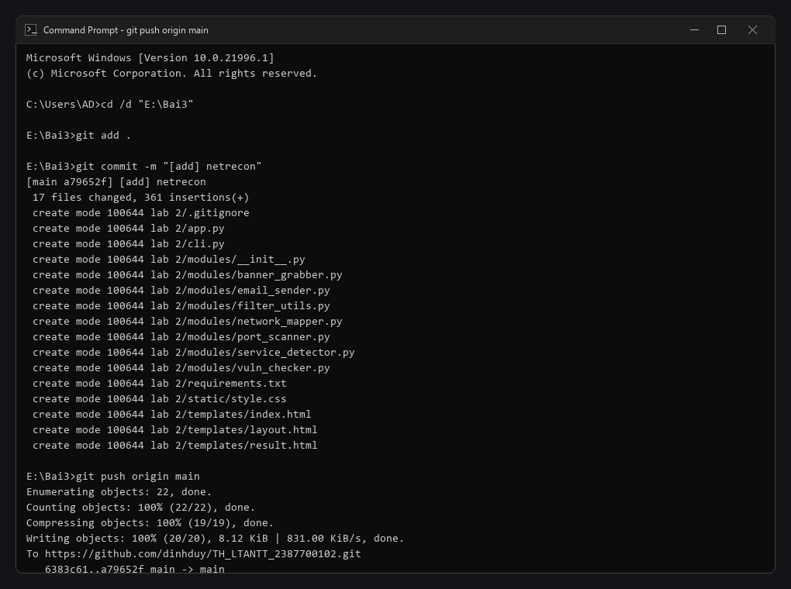

# 📑 BÁO CÁO THỰC HÀNH LAB 2: BỘ CÔNG CỤ TRINH SÁT VÀ THÁM SÁT MẠNG (NETRECON)

---

## 👨‍🎓 Thông tin sinh viên
- **Họ và tên:** Lê Đình Duy
- **Mã số sinh viên (MSSV):** 2387700102
- **Lớp:** 23DATA1
- **Username hệ thống:** dihdyyy
- **Email nhận báo cáo / SMTP:** dihdyyy@gmail.com
- **Môn học:** Bảo mật mạng máy tính / Lập trình An ninh thông tin
- **Bài thực hành:** Bài 3 - Lab 2: Bộ công cụ trinh sát mạng NetRecon đa giao diện (CLI & Web Dashboard)

---

## 🎯 Mục tiêu bài thực hành
1. Nắm vững nguyên lý và kỹ thuật quét cổng mạng (**Port Scanning**), phân biệt các trạng thái cổng (**Open**, **Closed**, **Filtered**).
2. Hiểu cơ chế nhận dạng phiên bản dịch vụ (**Service Fingerprinting**) và lấy biểu ngữ thông tin (**Banner Grabbing**).
3. Tích hợp và tự động hóa công cụ quét mạng nổi tiếng **Nmap** thông qua Python `subprocess`.
4. Lập trình bộ công cụ **NetRecon** với 7 module tính năng: quét cổng bất đồng bộ `asyncio` có kiểm soát tốc độ (`rate limiting`), phát hiện dịch vụ, trích xuất bảng ARP mạng cục bộ, đối soát cơ sở dữ liệu lỗ hổng CVE phổ biến và tự động gửi email báo cáo qua giao thức an toàn `SMTP_SSL`.
5. Xây dựng đồng thời hai giao diện tương tác: giao diện dòng lệnh (**CLI**) bằng thư viện `click` và giao diện Web Dashboard trực quan bằng **Flask** kết hợp **HTMX**.

---

## 🏗️ Cấu trúc thư mục dự án
```text
lab 2/
├── images/                     # Ảnh chụp minh chứng các bước thực nghiệm Lab 2
├── modules/                    # Thư viện 7 module trinh sát lõi
│   ├── port_scanner.py         # Quét cổng TCP bất đồng bộ (asyncio + Semaphore)
│   ├── service_detector.py     # Nhận dạng phiên bản dịch vụ Nmap (nmap -sV)
│   ├── banner_grabber.py       # Lấy banner dịch vụ trực tiếp qua Socket
│   ├── network_mapper.py       # Khám phá topo mạng qua lệnh arp -a
│   ├── vuln_checker.py         # Tra cứu cơ sở dữ liệu lỗ hổng CVE theo cổng
│   ├── email_sender.py         # Gửi email báo cáo tự động qua Gmail SMTP SSL (port 465)
│   ├── filter_utils.py         # Bộ lọc địa chỉ IP theo Whitelist / Blacklist
│   └── __init__.py             # Định danh Python package
├── templates/                  # Giao diện HTML template (Jinja2 + HTMX)
│   ├── layout.html             # Khung trang chuẩn có thông tin sinh viên & nhúng HTMX
│   ├── index.html              # Biểu mẫu quét mạng tích hợp AJAX HTMX
│   └── result.html             # Khung hiển thị kết quả phân tích động
├── static/                     # Tệp tĩnh CSS giao diện
│   └── style.css               # Phong cách giao diện Dark Mode hiện đại
├── .env                        # Biến môi trường bảo mật (SMTP_USER & SMTP_PASS)
├── .gitignore                  # Bỏ qua tệp nhạy cảm và cache
├── requirements.txt            # Danh sách thư viện Python phụ thuộc
├── cli.py                      # Giao diện dòng lệnh CLI (Click)
├── app.py                      # Máy chủ ứng dụng Web Flask
└── README.md                   # Hướng dẫn chi tiết triển khai bài Lab 2
```

---

## 🛠️ Các bước thực hiện & Kết quả kiểm thử

### Bước 1: Cài đặt công cụ Nmap và kiểm tra biến môi trường
- **Mục đích:** Cài đặt phần mềm Nmap trên Windows và đưa vào biến môi trường PATH để Python có thể gọi lệnh từ Terminal.
- **Lệnh thực hiện trên Terminal:**
  ```cmd
  nmap -v
  ```
- **Kết quả kỳ vọng:** Hiển thị thông tin phiên bản Nmap (ví dụ: `Starting Nmap 7.92...`).
- **📸 Ảnh chụp màn hình Terminal:**
  

---

### Bước 2: Tạo Mật khẩu ứng dụng Google (App Password) và cấu hình `.env`
- **Mục đích:** Tạo mã xác thực ứng dụng Gmail (16 ký tự) để phục vụ chức năng gửi email cảnh báo tự động mà không cần lưu mật khẩu chính của tài khoản Google.
- **Thao tác thực hiện:**
  - Truy cập `https://myaccount.google.com/apppasswords`.
  - Tạo app mới đặt tên là `Netrecon`, nhận mã 16 ký tự.
  - Cấu hình file `.env`:
    ```env
    SMTP_USER=dihdyyy@gmail.com
    SMTP_PASS=jyuy phiw pkbf zmom
    ```
- **📸 Ảnh chụp màn hình Google App Password & file .env:**
  

---

### Bước 3: Cài đặt các thư viện cần thiết (`requirements.txt`)
- **Mục đích:** Cài đặt các gói phụ thuộc: `flask`, `click`, `asyncio`, `python-dotenv`.
- **Lệnh thực hiện trên Terminal:**
  ```cmd
  cd "E:\Bai3\lab 2"
  pip install -r requirements.txt
  ```
- **Kết quả:** Các thư viện được cài đặt thành công trong môi trường Python.
- **📸 Ảnh chụp màn hình Terminal:**
  

---

### Bước 4: Kiểm thử công cụ qua giao diện dòng lệnh CLI (`cli.py`)
- **Mục đích:** Kiểm tra hoạt động của giao diện dòng lệnh xây dựng bằng thư viện `click` với các tùy chọn quét cổng, nhận diện dịch vụ, bắt banner, khám phá mạng ARP và kiểm tra CVE.
- **Lệnh thực hiện trên Terminal:**
  1. **Chạy tương tác đầy đủ:**
     ```cmd
     python cli.py
     ```
     *(Nhập Target IP: `127.0.0.1` hoặc IP mục tiêu kiểm thử)*
  2. **Quét nhanh cổng (Fast Scan):**
     ```cmd
     python cli.py --target scanme.nmap.org --ports 22,80 --mode scan
     ```
     *Kết quả trả về:*
     ```
     [+] 80/tcp open
     [+] 22/tcp open
     ```
  3. **Quét toàn diện (All Modes):**
     ```cmd
     python cli.py --target 127.0.0.1 --ports 22,80,443 --mode all
     ```
- **📸 Ảnh chụp màn hình Terminal:**
  

---

### Bước 5: Khởi động Web Server Flask (`app.py`)
- **Mục đích:** Kích hoạt máy chủ ứng dụng web phục vụ giao diện trinh sát mạng.
- **Lệnh thực hiện trên Terminal:**
  ```cmd
  python app.py
  ```
- **Kết quả hiển thị:**
  ```
  ============================================================
  NetRecon Web App - Sinh viên: Lê Đình Duy (MSSV: 2387700102)
  Lớp: 23DATA1 | Username: dihdyyy | Email: dihdyyy@gmail.com
  Đang khởi động trên http://127.0.0.1:5000
  ============================================================
  * Serving Flask app 'app'
  * Debug mode: on
  * Running on http://127.0.0.1:5000
  ```
- **📸 Ảnh chụp màn hình Terminal:**
  

---

### Bước 6: Nhập thông số và thực hiện trinh sát trên Web Dashboard
- **Mục đích:** Truy cập giao diện web tại `http://127.0.0.1:5000/`, điền các thông tin mục tiêu và kích hoạt quét qua request AJAX của HTMX.
- **Thao tác thực hiện:**
  - Mở trình duyệt web, vào địa chỉ: `http://127.0.0.1:5000/`.
  - **Target IP:** Nhập IP mục tiêu (ví dụ: `127.0.0.1`).
  - **Ports:** `22,80,443`.
  - **Mode:** Chọn `All`.
  - **Email nhận kết quả:** `dihdyyy@gmail.com`.
  - Bấm nút **Scan**.
- **📸 Ảnh chụp màn hình Trình duyệt:**
  

---

### Bước 7: Quan sát kết quả trinh sát trả về trực tiếp trên Web (HTMX)
- **Mục đích:** Xác minh kết quả phân tích mạng được tải động vào thẻ `#results` thông qua HTMX mà không cần tải lại toàn bộ trang web.
- **Nội dung kết quả hiển thị:**
  - **Service Detection:** Phiên bản hệ thống và trạng thái dịch vụ từ Nmap.
  - **Banner Grabbing:** Biểu ngữ phản hồi của từng cổng.
  - **Network Map:** Bảng ánh xạ địa chỉ IP và địa chỉ MAC vật lý từ lệnh ARP.
  - **Vulnerability Check:** Danh sách các mã lỗ hổng CVE cảnh báo đối với cổng tương ứng.
- **📸 Ảnh chụp màn hình Trình duyệt:**
  

---

### Bước 8: Kiểm tra Email báo cáo kết quả quét tự động
- **Mục đích:** Xác nhận hệ thống gửi email tự động đã đóng gói toàn bộ nội dung trinh sát và chuyển tiếp thành công đến hòm thư người dùng qua giao thức Gmail SMTP SSL.
- **Thao tác thực hiện:**
  - Mở hòm thư Gmail của địa chỉ `dihdyyy@gmail.com`.
  - Mở thư có tiêu đề: `Kết quả quét từ NetRecon [dihdyyy] - 127.0.0.1`.
  - Kiểm tra các mục: `--- SCAN ---`, `--- SERVICE ---`, `--- BANNER ---`, `--- MAP ---`, `--- VULN ---`.
- **📸 Ảnh chụp màn hình Hộp thư Gmail:**
  

---

### Bước 9: Đóng gói và Commit mã nguồn lên GitHub
- **Mục đích:** Lưu trữ phiên bản hoàn thiện của dự án lên kho chứa Git.
- **Lệnh thực hiện trên Terminal:**
  ```cmd
  git add .
  git commit -m "[add] netrecon"
  git push origin main
  ```
- **📸 Ảnh chụp màn hình Git:**
  

---

## 💡 Đánh giá và Kết luận
- **Hiệu năng & Tốc độ:** Cơ chế quét cổng bất đồng bộ bằng `asyncio` kết hợp `Semaphore` giúp tăng tốc độ quét mạng gấp nhiều lần so với quét tuần tự thông thường, đồng thời không gây quá tải tài nguyên mạng.
- **Khả năng tích hợp:** Ứng dụng tích hợp liền mạch công cụ chuyên sâu Nmap với các module tự phát triển (Banner Grabber, ARP Mapper, CVE Checker).
- **Trải nghiệm người dùng:** Giao diện kép (CLI cho chuyên gia an toàn thông tin / sysadmin và Web Dashboard HTMX mượt mà cho người dùng cuối) mang lại tính ứng dụng thực tế cao.
- **Tự động hóa cảnh báo:** Module gửi email qua SMTP SSL đảm bảo quản trị viên nhận được báo cáo kết quả trinh sát nhanh chóng và bảo mật.
